# PRJCTR HW5: Stress Test Practice

This project contains: TIG (telegraf, influxdb, grafana) stack which is monitoring FastAPI app with elasticsearch and
mongodb services.
Also, it includes scripts and configuration for running `siege` performance benchmarking tests.

Full description for all available services in this project is located in
previous homework's [repository](https://github.com/kirill-kundik/prjctr-hsa-homework-2/blob/latest/README.md).

## Build services

```bash
docker-compose build
```

## Run services

```bash
docker-compose up -d
```

## Run all tests

```bash
run_test.sh
```

### Results

Script output:

```
Running all siege tests
Each test will run for 180 seconds with different concurrency levels
Siege folder with urls.txt and output logs: ./siege
Total 6 tests: 10 25 50 100 150 250 concurrency levels
It will require at least 1080 seconds to run all tests
Running 10 concurrency test
Running 25 concurrency test
Running 50 concurrency test
Running 100 concurrency test
Running 150 concurrency test
Running 250 concurrency test
Successfully finished benchmarking
```

**siege output:**

| Date & Time         | Trans | Elap Time | Data Trans | Resp Time | Trans Rate | Throughput | Concurrent | OKAY  | Failed |
|---------------------|-------|-----------|------------|-----------|------------|------------|------------|-------|--------|
| 2023-03-11 11:10:55 | 3294  | 180.98    | 12         | 0.04      | 18.20      | 0.07       | 0.78       | 3294  | 0      |
| 2023-03-11 11:13:56 | 8479  | 180.96    | 30         | 0.04      | 46.86      | 0.17       | 2.00       | 8479  | 0      |
| 2023-03-11 11:16:57 | 15603 | 180.97    | 54         | 0.08      | 86.22      | 0.30       | 6.90       | 15603 | 0      |
| 2023-03-11 11:19:58 | 19573 | 180.96    | 66         | 0.42      | 108.16     | 0.36       | 45.60      | 19573 | 0      |
| 2023-03-11 11:22:59 | 17446 | 180.96    | 60         | 1.05      | 96.41      | 0.33       | 101.00     | 17446 | 0      |
| 2023-03-11 11:26:00 | 14390 | 180.95    | 50         | 2.59      | 79.52      | 0.28       | 205.81     | 14390 | 0      |

### Grafana Dashboards while benchmarking

#### Performance metrics

**Concurrency level: 100**

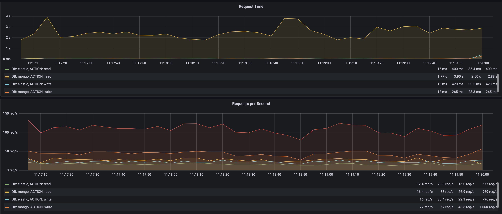

---

**Concurrency level: 150**

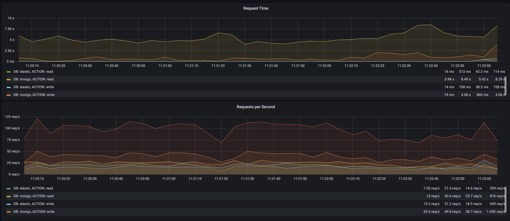

---

**Concurrency level: 250**

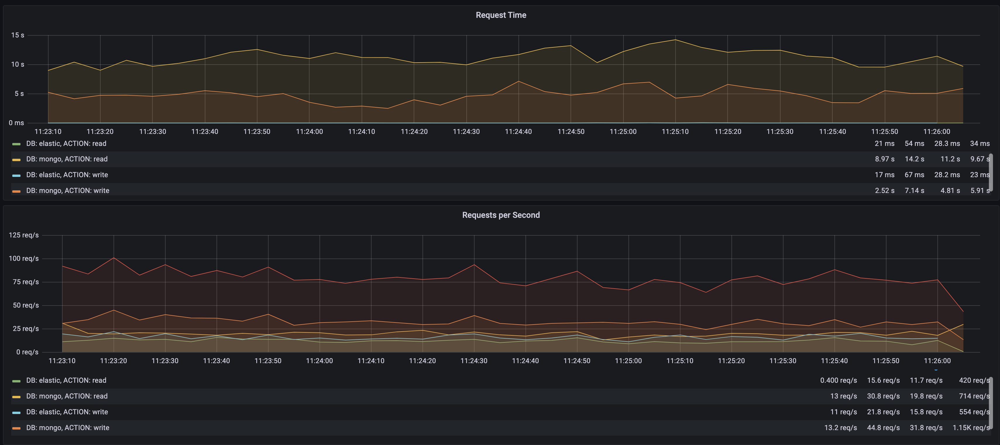

---

We see that `mongo` service requests take too long time to respond.
So I made some tests only for `elasticsearch` to check its benchmarks.

---

**Only elasticsearch. Concurrency level: 250**

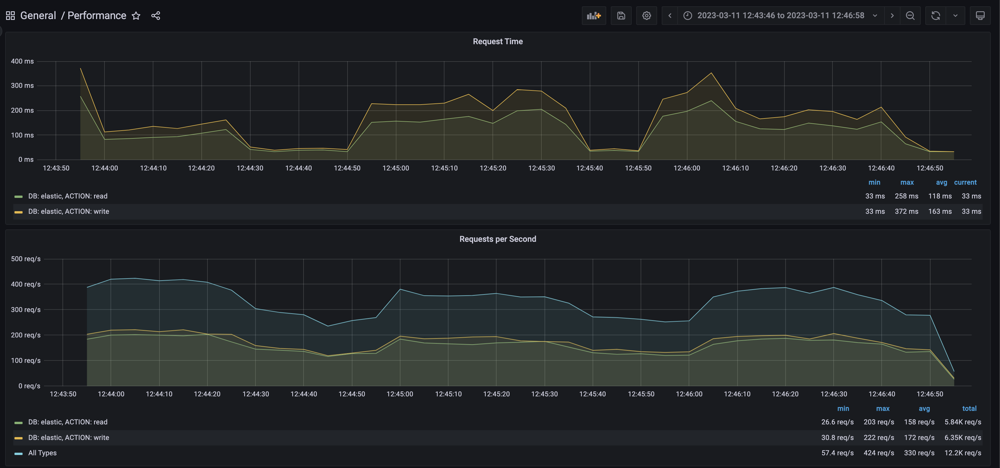

---

**Only elasticsearch. Concurrency level: 500**

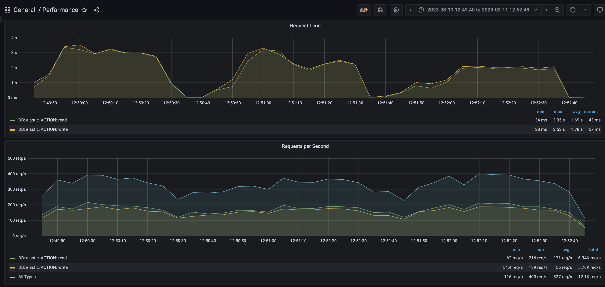

---

**Siege output for elasticsearch benchmarking:**

| Date & Time         | Trans | Elap Time | Data Trans | Resp Time | Trans Rate | Throughput | Concurrent | OKAY  | Failed |
|---------------------|-------|-----------|------------|-----------|------------|------------|------------|-------|--------|
| 2023-03-11 12:43:13 | 34509 | 180.88    | 366        | 0.03      | 190.78     | 2.02       | 4.93       | 34509 | 0      |
| 2023-03-11 12:46:51 | 60952 | 180.97    | 648        | 0.25      | 336.81     | 3.58       | 82.55      | 60952 | 0      |
| 2023-03-11 12:52:42 | 60443 | 180.23    | 704        | 0.99      | 335.37     | 3.91       | 330.43     | 60443 | 32     |

---

#### System metrics

**Concurrency levels: 100, 150, 250**

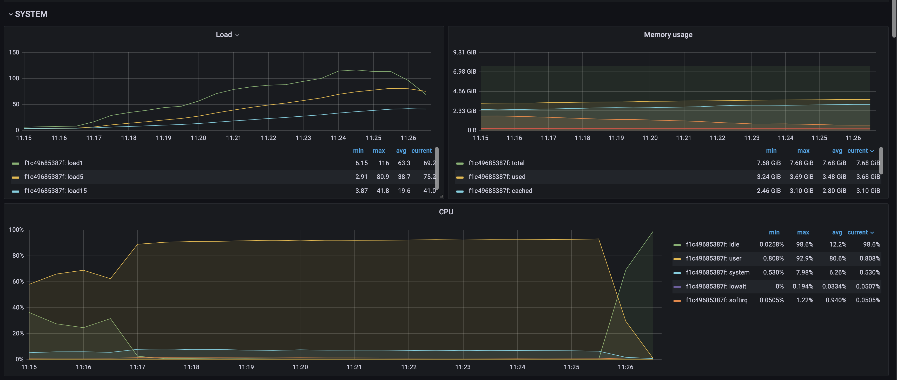

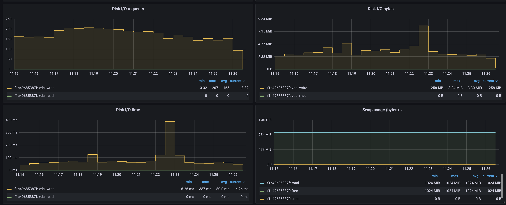

---

**Only elasticsearch. Concurrency level: 500**

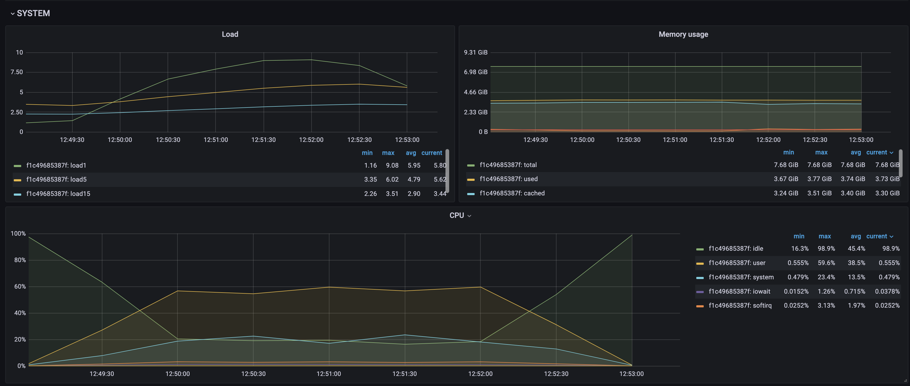

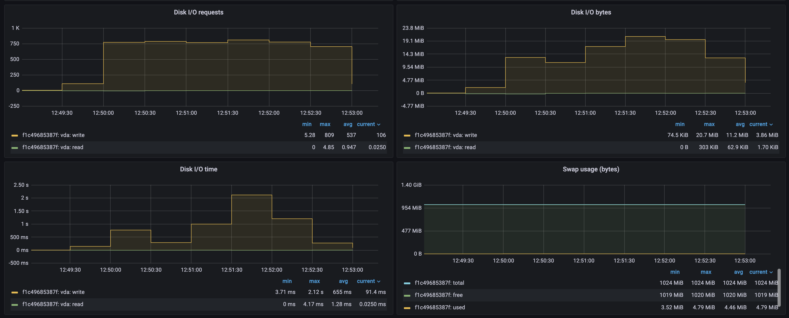

---

#### Elastic metrics

**Concurrency levels: 100, 150, 250**

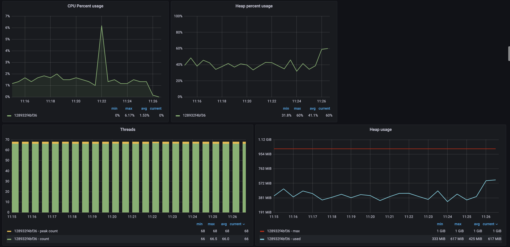

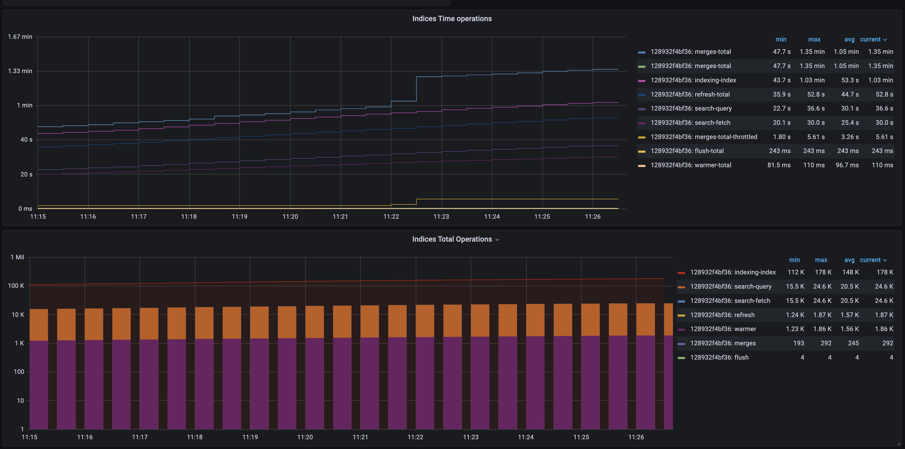

---

**Only elasticsearch. Concurrency level: 500**

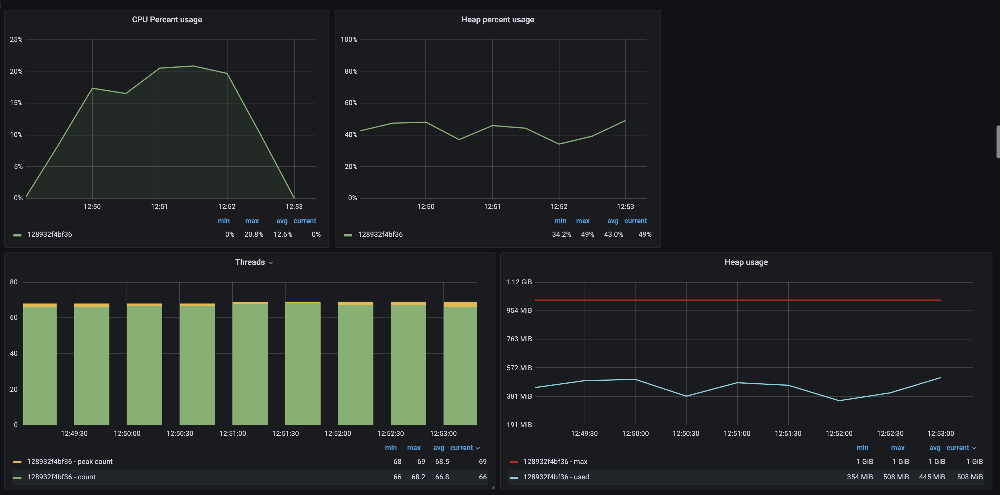

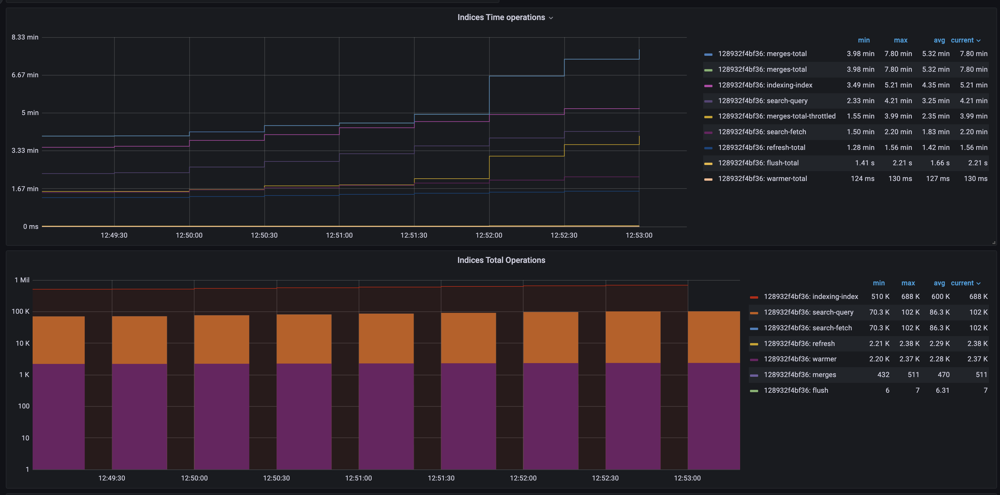

---

#### Docker metrics

**Concurrency levels: 100, 150, 250**

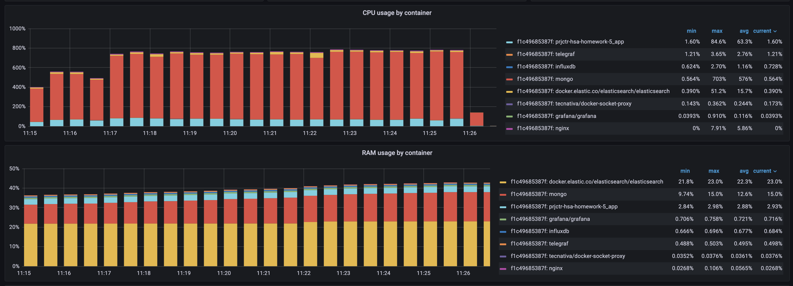

---

**Only elasticsearch. Concurrency level: 500**

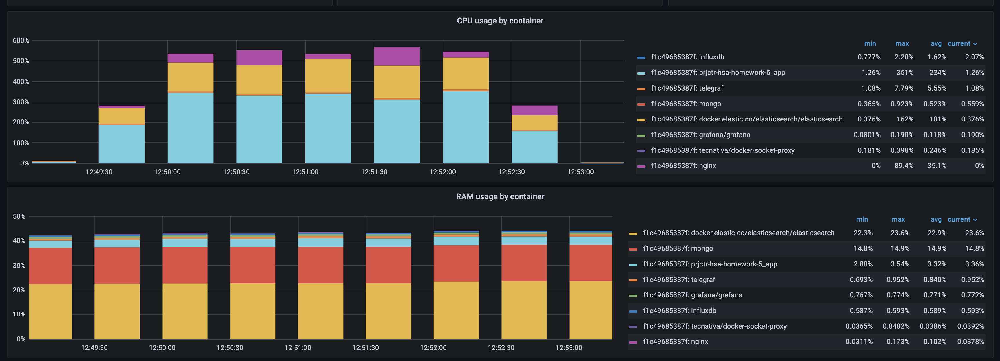

---

### Running single test

To run a single `siege` test use following command:

```bash
siege -c10 -d1 -i -q -t180s --content-type "application/json" --file=./siege/urls.txt --log=./siege/10_test.log
```

This will run `siege` benchmarking with:

* concurrency level 10 –– `-c10`
* delay between requests 1s –– `-d1`
* in internet mode *(URLs from `--file` flag are shuffled)* –– `-i`
* for 180 seconds -- `-t180s`.

You could also specify number of total requests to run with `-r` flag.

### Changing siege URLs

The structure of JSON data, that is uploaded during `siege` tests, defined
in [siege_config_generator.py](app%2Fsiege_config_generator.py).

To generate new URLs you should follow instructions:

* Install dev requirements: `pip install -r requirements-dev.txt`
* Change and run `python siege_config_generator.py` script
* New URLs will be located in [urls.txt](siege%2Furls.txt)
